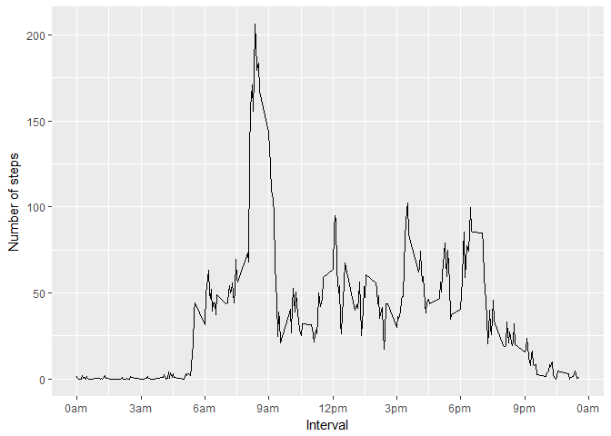

```r
library(ggplot2)
```

```
## Warning: package 'ggplot2' was built under R version 3.4.2
```

&nbsp;

## Loading and preprocessing the data


```r
direct<-getwd()
setwd(direct)
file.study<-unzip("activity.zip")
my.data<-read.csv(file.study, header = T)
if (file.exists("activity.csv")) file.remove("activity.csv")
```

```
## [1] TRUE
```

```r
#structure of data
str(my.data)
```

```
## 'data.frame':	17568 obs. of  3 variables:
##  $ steps   : int  NA NA NA NA NA NA NA NA NA NA ...
##  $ date    : Factor w/ 61 levels "2012-10-01","2012-10-02",..: 1 1 1 1 1 1 1 1 1 1 ...
##  $ interval: int  0 5 10 15 20 25 30 35 40 45 ...
```

&nbsp;

## What is mean total number of steps taken per day?

```r
#aggregation of total number steps by day
total.day<-aggregate(x=my.data$steps,by=list(my.data$date), sum)

#Make a histogram of the total number of steps taken each day:
hist(total.day$x, main="number of steps by day", xlab="steps", col="blue")
```

<!-- -->

```r
#Calculate and report the mean and median total number of steps taken per day
y1<-round(mean(total.day$x, na.rm = T),2) #mean
y2<-round(median(total.day$x, na.rm = T),2) #median

paste("The mean is ", y1, " steps per day and the median is ", y2, sep = "")
```

```
## [1] "The mean is 10766.19 steps per day and the median is 10765"
```

&nbsp;

## What is the average daily activity pattern?


```r
#Make a time series plot (i.e. type = "l") of the 5-minute interval (x-axis)
#and the average number of steps taken, averaged across all days (y-axis)

mean.day.inter<-aggregate(x=my.data$steps,by=list(my.data$interval), mean, na.rm=T)

ggplot(mean.day.inter, aes(Group.1, x)) + geom_line() +
   xlab("Interval") + ylab("Number of steps")+
    scale_x_continuous(breaks = seq(0,2400,300), 
                       labels = c(paste(seq(0,9,3),"am", sep=""),"12pm",
                                  paste(seq(3,9,3),"pm", sep=""), "0am"))
```

<!-- -->

```r
#Which 5-minute interval, on average across all the days in the dataset,
#contains the maximum number of steps?

xo<-mean.day.inter$Group.1[which.max(mean.day.inter$x)]

paste("The interval is (", xo, ",", xo+5, ")", sep="")
```

```
## [1] "The interval is (835,840)"
```

&nbsp;

## Imputing missing values


```r
#Calculate and report the total number of missing values in the dataset
#(i.e. the total number of rows with NAs)

conteo<-function(y)
    {
        length(y[is.na(y)==T])
    }

z<-apply(my.data,2,conteo)

nombres<-names(z)

paste("The number of nas in ", nombres, " is ", z, ". ", sep = "")
```

```
## [1] "The number of nas in steps is 2304. "
## [2] "The number of nas in date is 0. "    
## [3] "The number of nas in interval is 0. "
```

```r
#Devise a strategy for filling in all of the missing values in the dataset. The
#strategy does not need to be sophisticated. For example, you could use
#the mean/median for that day, or the mean for that 5-minute interval, etc.

#Response: the strategy will be based on the trimmed mean at 10% per interval_day

mean.trim<-function(x){mean(x, trim=0.1, na.rm=T)}

ref.day.inter<-aggregate(x=my.data$steps,by=list(my.data$interval),mean.trim )

sequence<-ref.day.inter$Group.1

complete.data<-my.data

for (i in sequence)
    {
        complete.data$steps[complete.data$interval==i & is.na(complete.data$steps)]<-
                        ref.day.inter$x[ref.day.inter$Group.1==i]
    
    }

#verifying

z<-apply(complete.data,2,conteo)

nombres<-names(z)

paste("The number of nas in ", nombres[1], " is ", z[1], sep = "")
```

```
## [1] "The number of nas in steps is 0"
```

```r
#Make a histogram of the total number of steps taken each day and Calculate
#and report the mean and median total number of steps taken per day.

#aggregation of total number steps by day
total.day.new<-aggregate(x=complete.data$steps,by=list(complete.data$date), sum)

#Make a histogram of the total number of steps taken each day:
hist(total.day.new$x, main="number of steps by day", xlab="steps", col="blue")
```

<!-- -->

```r
#Calculate and report the mean and median total number of steps taken per day
y1.new<-round(mean(total.day.new$x, na.rm = T),2) #mean
y2.new<-round(median(total.day.new$x, na.rm = T),2) #median

paste("The mean is ", y1.new, " steps per day and the median is ", y2.new, sep = "")
```

```
## [1] "The mean is 10016.93 steps per day and the median is 10395"
```

```r
#Do these values differ from the estimates from the first part of the assignment?
#What is the impact of imputing missing data on the estimates of the total
#daily number of steps?

#Distributions are differents?

compare<-function(x.old, x.new){
plot(density(x.old, na.rm = T), col="blue", lty=1, main="Comparing distributions")
lines(density(x.new), col="red", lty=2)
legend("topright", legend=c("with nas", "no-nas"),
       col=c("blue", "red"), lty=1:2, cex=0.8)

}

compare(x.old = total.day$x, x.new = total.day.new$x)
```

<!-- -->

```r
ks.test(x=total.day$x, y=total.day.new$x, 
        alternative = "two.sided")
```

```
## Warning in ks.test(x = total.day$x, y = total.day.new$x, alternative =
## "two.sided"): cannot compute exact p-value with ties
```

```
## 
## 	Two-sample Kolmogorov-Smirnov test
## 
## data:  total.day$x and total.day.new$x
## D = 0.1163, p-value = 0.8377
## alternative hypothesis: two-sided
```

```r
resul<-data.frame(mean=c(y1,y1.new), median=c(y2,y2.new))
row.names(resul)<-c("with nas", "no-nas")

#Comparing means and medians

resul
```

```
##              mean median
## with nas 10766.19  10765
## no-nas   10016.93  10395
```

```r
#Comparing means
t.test(total.day$x[complete.cases(total.day$x)], total.day.new$x, alternative = "two.sided")
```

```
## 
## 	Welch Two Sample t-test
## 
## data:  total.day$x[complete.cases(total.day$x)] and total.day.new$x
## t = 0.91892, df = 110.75, p-value = 0.3601
## alternative hypothesis: true difference in means is not equal to 0
## 95 percent confidence interval:
##  -866.4827 2364.9935
## sample estimates:
## mean of x mean of y 
##  10766.19  10016.93
```

```r
#Comparing medians
wilcox.test(total.day$x[complete.cases(total.day$x)], total.day.new$x, alternative = "two.sided")
```

```
## 
## 	Wilcoxon rank sum test with continuity correction
## 
## data:  total.day$x[complete.cases(total.day$x)] and total.day.new$x
## W = 1780.5, p-value = 0.3528
## alternative hypothesis: true location shift is not equal to 0
```

```r
#Rpta: The statistics are not showing significant differences
```

&nbsp;

## Are there differences in activity patterns between weekdays and weekends?


```r
#Create a new factor variable in the dataset with two levels – “weekday” and “weekend” indicating whether a given date is a weekday or weekend day.

complete.data$day.week<-weekdays(as.Date(complete.data$date))

complete.data$type.day<-ifelse(complete.data$day.week=="sábado" |
     complete.data$day.week=="domingo","weekends", "weekdays")


#Make a panel plot containing a time series plot (i.e. type = "l") of the 5-minute interval (x-axis) and the average number of steps taken, averaged across all weekday days or weekend days (y-axis).

mean.day.inter2<-aggregate(x=complete.data$steps,by=list(complete.data$type.day,
complete.data$interval), mean, na.rm=T)

colnames(mean.day.inter2)<-c("type.day", "interval", "steps.mean")

head(mean.day.inter2)
```

```
##   type.day interval steps.mean
## 1 weekdays        0  2.0222222
## 2 weekends        0  0.0000000
## 3 weekdays        5  0.4000000
## 4 weekends        5  0.0000000
## 5 weekdays       10  0.1555556
## 6 weekends       10  0.0000000
```

```r
ggplot(mean.day.inter2, aes(x=interval, y=steps.mean))+ facet_grid(mean.day.inter2$type.day ~ .) + geom_line() +   xlab("Interval") + ylab("Number of steps")+ scale_x_continuous(breaks = seq(0,2400,300), 
                       labels = c(paste(seq(0,9,3),"am", sep=""),"12pm",
                                  paste(seq(3,9,3),"pm", sep=""), "0am"))
```

<!-- -->

```r
boxplot(mean.day.inter2$steps.mean~mean.day.inter2$type.day, main="Comparing steps")
```

<!-- -->

```r
summary(aov(mean.day.inter2$steps.mean~mean.day.inter2$type.day+
                as.factor(mean.day.inter2$interval)))
```

```
##                                      Df Sum Sq Mean Sq F value  Pr(>F)    
## mean.day.inter2$type.day              1   6898    6898  10.356 0.00144 ** 
## as.factor(mean.day.inter2$interval) 287 753768    2626   3.943 < 2e-16 ***
## Residuals                           287 191159     666                    
## ---
## Signif. codes:  0 '***' 0.001 '**' 0.01 '*' 0.05 '.' 0.1 ' ' 1
```

```r
#Response: Considering the panel plot and the others results, there is differences between weekdays and weekends.
```

&nbsp;
